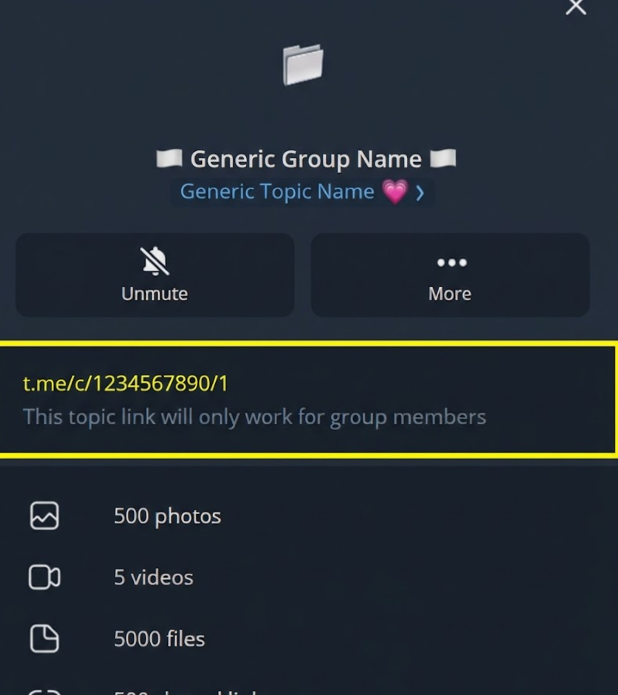

# Telegram Media Downloader

[](https://github.com/rfsbraz/telegram-downloader/actions/workflows/ci.yml)
[](https://github.com/rfsbraz/telegram-downloader/actions/workflows/docker.yml)
[](LICENSE)
[](https://hub.docker.com/r/rfsbraz/telegram-downloader)

A self-hosted daemon that automatically downloads media from Telegram channels, groups, and forum topics. Configure once, run forever.

[**Documentation**](https://rfsbraz.github.io/telegram-downloader/) · [**Quick Start**](#-quick-start) · [**Examples**](#-examples)

---

## Why?

Telegram is great for sharing files, but manually downloading from multiple sources is tedious. This tool runs in the background and:

- Downloads new files as they're posted
- Filters by extension, size, date, or filename pattern
- Organizes files into folders by source
- Skips duplicates automatically
- Sends notifications when downloads complete

## Features

| Feature | Description |
|---------|-------------|
| **Multi-Source** | Channels, groups, supergroups, forum topics, private chats |
| **Smart Filtering** | By extension, file size, date range, filename patterns |
| **Auto-Organization** | Per-source folders, duplicate detection, conflict resolution |
| **Daemon Mode** | Runs continuously with configurable check intervals |
| **Notifications** | Discord webhooks, generic HTTP POST |
| **Docker Native** | Multi-arch images (amd64/arm64), health checks, non-root |

## Quick Start

### Prerequisites

- Docker and Docker Compose
- Telegram API credentials from [my.telegram.org/apps](https://my.telegram.org/apps)
- Telegram account with access to desired channels/groups
- 
  
### Setup

```bash
# Create project directory
mkdir telegram-downloader && cd telegram-downloader

# Create docker-compose.yml
cat > docker-compose.yml << 'EOF'
services:
  telegram-downloader:
    image: rfsbraz/telegram-downloader:latest
    restart: unless-stopped
    environment:
      - TDL_API_ID=YOUR_API_ID
      - TDL_API_HASH=YOUR_API_HASH
      - TDL_PHONE_NUMBER=+1234567890
      - TDL_DAEMON_ENABLED=true
      - TDL_DAEMON_CHECK_INTERVAL=300
      - TDL_SOURCES_0_URL=https://t.me/example_channel
    volumes:
      - ./downloads:/downloads
      - ./sessions:/app/.sessions
    stdin_open: true
    tty: true
EOF

# Start
docker compose run --rm telegram-downloader
```

On first run, you'll be prompted for the Telegram verification code sent to your phone. After authentication, restart with `docker compose up -d` for daemon mode.

## Configuration

All configuration is done via environment variables with the `TDL_` prefix.

### Sources

```yaml
# Public channel
- TDL_SOURCES_0_URL=https://t.me/channel_name

# Private channel/group (use the t.me/c/ link format)
- TDL_SOURCES_1_URL=https://t.me/c/1234567890/1

# Forum topic (chat_id/topic_id)
- TDL_SOURCES_2_URL=https://t.me/c/1234567890/123
```

### Filters

```yaml
# File extensions (comma-separated)
- TDL_SOURCES_0_FILTERS_EXTENSIONS=.pdf,.epub,.mobi

# Size limits
- TDL_SOURCES_0_FILTERS_MIN_SIZE=100KB
- TDL_SOURCES_0_FILTERS_MAX_SIZE=500MB

# Global defaults (apply to all sources)
- TDL_GLOBAL_FILTERS_EXTENSIONS=.pdf,.epub
```

### Daemon Mode

```yaml
- TDL_DAEMON_ENABLED=true
- TDL_DAEMON_CHECK_INTERVAL=300  # seconds between checks
```

### Notifications

```yaml
- TDL_NOTIFICATIONS_ENABLED=true
- TDL_NOTIFICATIONS_DISCORD_WEBHOOK_URL=https://discord.com/api/webhooks/...
- TDL_NOTIFICATIONS_DETAIL_LEVEL=summary  # minimal, summary, or detailed
```

See the [full configuration reference](https://rfsbraz.github.io/telegram-downloader/configuration/) for all options.

## Examples

Complete Docker Compose configurations for common use cases:

| Example | Description |
|---------|-------------|
| [ebook-forum.yml](examples/ebook-forum.yml) | Download ebooks from forum topics |
| [youtube-archiver.yml](examples/youtube-archiver.yml) | Archive YouTube mirror channels |
| [news-aggregator.yml](examples/news-aggregator.yml) | Aggregate media from news channels |
| [personal-backup.yml](examples/personal-backup.yml) | Backup your saved messages |

## Docker Images

Available from Docker Hub and GitHub Container Registry:

```bash
# Docker Hub
docker pull rfsbraz/telegram-downloader:latest

# GitHub Container Registry
docker pull ghcr.io/rfsbraz/telegram-downloader:latest
```

### Tags

| Tag | Description |
|-----|-------------|
| `latest` | Latest stable release |
| `edge` | Latest main branch (may be unstable) |
| `v1.2.3` | Specific version |
| `v1.2` | Latest patch for minor version |
| `v1` | Latest minor for major version |
| `sha-abc1234` | Specific commit |

### Architectures

- `linux/amd64` — Intel/AMD x86_64
- `linux/arm64` — Raspberry Pi 4+, Apple Silicon, AWS Graviton

## Troubleshooting

| Error | Solution |
|-------|----------|
| `PEER_ID_INVALID` | The chat ID is invalid or you haven't joined the chat. Open it in Telegram first. |
| `FloodWait X` | Rate limited by Telegram. The daemon waits automatically. Increase check interval if persistent. |
| `AUTH_KEY_UNREGISTERED` | Session expired. Delete `./sessions/` and re-authenticate. |
| Health check failing | Check logs with `docker compose logs -f` |

See the [troubleshooting guide](https://rfsbraz.github.io/telegram-downloader/troubleshooting/) for more.

## Development

```bash
# Clone
git clone https://github.com/rfsbraz/telegram-downloader.git
cd telegram-downloader

# Install dependencies
pip install -r requirements.txt

# Run tests
pytest tests/ -v

# Build Docker image locally
docker build -t telegram-downloader .
```

## Contributing

Contributions are welcome! Please:

1. Fork the repository
2. Create a feature branch (`git checkout -b feature/amazing-feature`)
3. Commit with conventional commits (`feat:`, `fix:`, `docs:`, etc.)
4. Push and open a Pull Request

## License

MIT — see [LICENSE](LICENSE) for details.

## Acknowledgments

- [Pyrogram](https://docs.pyrogram.org/) — Telegram MTProto API framework
- [Pydantic](https://docs.pydantic.dev/) — Data validation
- [docker/metadata-action](https://github.com/docker/metadata-action) — Docker tagging
