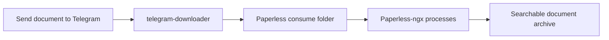

# :material-file-document-multiple: Paperless-ngx Ingestion

Automatically ingest documents into Paperless-ngx by sending them to a private Telegram chat. Perfect for mobile document capture.

## Use Case

!!! info "Perfect For"
    - :material-cellphone: Mobile document scanning and capture
    - :material-receipt: Receipt and invoice collection
    - :material-file-send: Quick document ingestion from anywhere
    - :material-home-automation: Home automation workflows

## How It Works



1. Send a document (photo, PDF, scan) to your private Telegram chat
2. telegram-downloader monitors the chat and downloads new files
3. Files are saved directly to Paperless-ngx's consume folder
4. Paperless-ngx automatically OCRs and indexes the document

## Quick Start

### Create docker-compose.yml:

```yaml
services:
  telegram-downloader:
    image: rfsbraz/telegram-downloader:latest
    container_name: telegram-paperless-ingestion
    restart: unless-stopped

    environment:
      # Telegram API credentials
      - TDL_API_ID=YOUR_API_ID
      - TDL_API_HASH=YOUR_API_HASH
      - TDL_PHONE_NUMBER=YOUR_PHONE_NUMBER

      # Daemon configuration - check frequently for quick ingestion
      - TDL_DAEMON_ENABLED=true
      - TDL_DAEMON_CHECK_INTERVAL=60  # Check every minute

      # Source: Your "Saved Messages" as document inbox
      - TDL_SOURCES_0_URL=https://t.me/me
      - TDL_SOURCES_0_NAME=inbox  # Paperless subfolder
      - TDL_SOURCES_0_FILTERS_EXTENSIONS=.pdf,.png,.jpg,.jpeg,.tiff,.webp

    volumes:
      # Mount directly to Paperless consume folder
      - /path/to/paperless/consume:/downloads
      - ./sessions:/app/.sessions

    healthcheck:
      test: ["CMD", "python3", "/app/healthcheck.py"]
      interval: 2m
      timeout: 10s

  # Optional: Run alongside Paperless-ngx
  # paperless:
  #   image: ghcr.io/paperless-ngx/paperless-ngx:latest
  #   volumes:
  #     - /path/to/paperless/consume:/usr/src/paperless/consume
```

### Deploy:

```bash
mkdir telegram-paperless && cd telegram-paperless
mkdir sessions

# Create docker-compose.yml with configuration above
# Update /path/to/paperless/consume to your actual Paperless consume path

docker compose up -d
docker compose logs -f  # Authenticate on first run
```

## Configuration Highlights

### Using Saved Messages as Inbox

```yaml
- TDL_SOURCES_0_URL=https://t.me/me
- TDL_SOURCES_0_NAME=inbox
```

!!! tip "Why Saved Messages?"
    - Always accessible from any device
    - Private - only you can see it
    - No need to create a separate chat
    - Forward documents from other chats easily

### Alternative: Private Group

Create a private group for document ingestion:

```yaml
- TDL_SOURCES_0_URL=https://t.me/c/1234567890/1
- TDL_SOURCES_0_NAME=documents
```

!!! info "Private Group Benefits"
    - Share access with family members
    - Separate from your Saved Messages
    - Can add a bot for confirmations

### Document Formats

```yaml
# All formats Paperless-ngx supports
- TDL_SOURCES_0_FILTERS_EXTENSIONS=.pdf,.png,.jpg,.jpeg,.tiff,.webp,.gif

# PDF only (already digitized documents)
- TDL_SOURCES_0_FILTERS_EXTENSIONS=.pdf

# Images only (photos of documents)
- TDL_SOURCES_0_FILTERS_EXTENSIONS=.png,.jpg,.jpeg
```

### Quick Ingestion

```yaml
# Check every 30 seconds for near real-time ingestion
- TDL_DAEMON_CHECK_INTERVAL=30
```

## Integration with Existing Paperless-ngx

### Option 1: Shared Volume

If Paperless-ngx is already running, mount to its consume folder:

```yaml
volumes:
  - /path/to/paperless/consume:/downloads
```

### Option 2: Same Docker Network

```yaml
services:
  telegram-downloader:
    # ... config ...
    volumes:
      - paperless_consume:/downloads
    networks:
      - paperless_network

networks:
  paperless_network:
    external: true

volumes:
  paperless_consume:
    external: true
```

### Option 3: Subfolder Organization

Use the source name to create a subfolder in consume:

```yaml
# Documents go to: consume/telegram-inbox/
- TDL_SOURCES_0_NAME=telegram-inbox
```

## Expected Results

### Workflow Example

1. **Capture:** Take photo of receipt on phone
2. **Send:** Share to Telegram Saved Messages
3. **Download:** telegram-downloader saves to consume folder (within 1 minute)
4. **Process:** Paperless-ngx OCRs and indexes automatically
5. **Search:** Find receipt later by searching content

### Folder Structure

```
paperless/consume/
└── inbox/
    ├── receipt_2026-01-24.jpg
    ├── invoice_acme.pdf
    └── tax_document.pdf
```

### Verification

```bash
# Watch consume folder for new files
watch -n 5 'ls -la /path/to/paperless/consume/inbox/'

# Check Paperless-ngx processing
docker logs paperless-webserver --tail 20
```

## Advanced Configuration

### Multiple Inboxes

Separate personal and business documents:

```yaml
# Personal documents
- TDL_SOURCES_0_URL=https://t.me/me
- TDL_SOURCES_0_NAME=personal

# Business documents (private group)
- TDL_SOURCES_1_URL=https://t.me/c/1234567890/1
- TDL_SOURCES_1_NAME=business
```

### Size Limits

```yaml
# Skip tiny images (likely not documents)
- TDL_SOURCES_0_FILTERS_MIN_SIZE=50KB

# Skip huge files
- TDL_SOURCES_0_FILTERS_MAX_SIZE=50MB
```

### Filename Patterns

```yaml
# Only files with "invoice" or "receipt" in name
- TDL_SOURCES_0_FILTERS_FILENAME_PATTERN=(?i)(invoice|receipt|bill)
```

## Paperless-ngx Tips

### Automatic Tagging

Configure Paperless-ngx to auto-tag documents from the Telegram inbox:

```python
# In Paperless-ngx matching rules:
# Path contains "inbox" -> Add tag "telegram-import"
```

### Consumption Folder Structure

Paperless-ngx supports subfolders in consume:

```
consume/
├── inbox/          # From Telegram (auto-tagged)
├── scanner/        # From network scanner
└── email/          # From email import
```

## Troubleshooting

!!! bug "Documents Not Appearing in Paperless"
    Check:

    1. Files are in the consume folder: `ls /path/to/paperless/consume/inbox/`
    2. Paperless consumer is running: `docker logs paperless-webserver`
    3. File permissions allow Paperless to read

!!! warning "Duplicate Documents"
    telegram-downloader skips duplicates by default. If you're seeing duplicates in Paperless:

    - Check if you're sending the same file multiple times
    - Paperless-ngx has its own duplicate detection

!!! info "Slow Processing"
    - Increase check interval if API rate limits occur
    - Paperless OCR takes time for large documents
    - Check Paperless-ngx logs for processing status

## Security Considerations

!!! danger "Sensitive Documents"
    Documents may contain sensitive information:

    - Use Saved Messages (encrypted, private)
    - Secure the consume folder permissions
    - Enable Paperless-ngx encryption if needed

## Related Examples

- [Personal Backup](personal-backup.md) - Similar saved messages setup
- [Ebook Forum](ebook-forum.md) - Document filtering patterns

[:material-download: Download paperless-ingestion.yml](https://raw.githubusercontent.com/rfsbraz/telegram-downloader/main/examples/paperless-ingestion.yml){ .md-button }

[Back to Examples](index.md){ .md-button }
